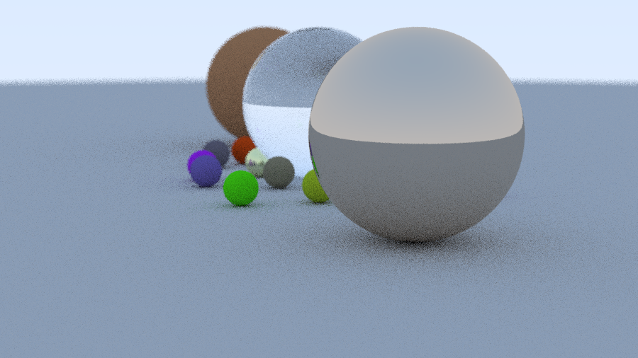

# 🌟 离线光线追踪渲染器 | Offline Ray Tracer

一个基于 C++ 从头构建的离线路径追踪渲染器，支持多种材质、景深、可自由摆放的相机以及蒙特卡洛采样。渲染结果输出为标准的 **PPM** 图像格式。



> 上图参数：`900×506` | 每像素 10 采样 | 最大递归深度 5 | 场景包含随机生成的漫反射球、金属球与玻璃球，以及 3 个主体球（玻璃、漫反射、金属）。

---

## ✨ 核心特性

| 特性 | 说明 |
|------|------|
| **多材质支持** | Lambertian（漫反射）、Metal（金属，带 fuzz 粗糙度）、Dielectric（玻璃/电介质，带折射与 Schlick 近似反射） |
| **真实相机模型** | 可配置视场角（FOV）、自由放置机位与观察点、支持景深散焦（Defocus Blur） |
| **蒙特卡洛采样** | 每像素多重采样（MSAA）+ 随机半球/单位球采样，柔化锯齿与噪点 |
| **递归路径追踪** | 光线与材质交互后递归弹射，直到达到最大深度或不再命中物体 |
| **伽马校正** | 输出前对颜色进行 `sqrt` 伽马校正，使亮度更符合人眼感知 |
| **PPM 输出** | 纯文本/二进制 PPM 格式，兼容性高，可用多数看图软件直接打开 |

---

## 📁 项目结构

```
Ray/
├── main.cpp                 # 场景构建与渲染入口
├── ClassBase/
│   ├── ClassBase.h / .cpp   # Vec3、Color、Ray、Point 等基础数学类
│   ├── Camera.h / .cpp      # 相机：光线生成、采样、景深、渲染循环
│   └── Material.h / .cpp    # 材质基类与三种材质实现
├── HitLa/
│   ├── Hit.h / .cpp         # 命中记录、可命中物体抽象、球体与物体列表
├── Uitils/
│   ├── uitils.h / .cpp      # 工具函数：随机数生成、角度转换、区间类
├── MATH.h                   # 数学相关头文件聚合
├── output.ppm               # 最新渲染输出（PPM 源文件）
├── render.png               # 转换后的渲染预览图
└── README.md                # 本文件
```

---

## 🚀 快速开始

### 环境要求

- Windows / Linux / macOS
- 支持 C++11 或更高版本的编译器（MSVC、GCC、Clang 均可）

### 使用 Visual Studio 编译

1. 打开 `Ray.sln`。
2. 选择平台（如 `x64`）并点击 **生成 → 生成解决方案**。
3. 运行生成的 `Ray.exe`，程序会在同级目录输出 `output.ppm`。

### 使用命令行编译（MinGW / GCC）

```bash
g++ -std=c++11 -O2 -o Ray main.cpp ClassBase/ClassBase.cpp ClassBase/Camera.cpp ClassBase/Material.cpp HitLa/Hit.cpp Uitils/uitils.cpp
./Ray
```

### 查看渲染结果

- 直接用 **IrfanView**、**GIMP**、**Photoshop** 等支持 PPM 格式的软件打开 `output.ppm`。
- 或在项目目录中查看已转换好的 `render.png`。

---

## 🎨 场景说明

`main.cpp` 中构建了一个经典的光线追踪测试场景：

- **地面**：一个巨大的灰色 Lambertian 球体作为地板。
- **随机小球阵列**：在 `(a, b)` 网格上随机生成小球，按概率分配材质：
  - `80%` 概率为 **漫反射**（随机 albedo）
  - `15%` 概率为 **金属**（随机 albedo + 0~0.5 fuzz）
  - `5%` 概率为 **玻璃**（折射率 1.5）
- **三大主体球**（从左到右）：
  1. **漫反射球**（土黄色，`(-4, 1, 0)`）
  2. **玻璃球**（透明，`(0, 1, 0)`）
  3. **金属球**（金色，`(4, 1, 0)`）

相机放置在 `(13, 2, 3)`，看向原点，带有轻微景深效果，模拟真实镜头的散焦。

---

## ⚙️ 可配置参数

在 `main.cpp` 或 `Camera.h` 中，你可以轻松调整以下参数：

```cpp
Camera cam;
cam.aspect_ratio      = 16.0 / 9.0;   // 宽高比
cam.image_width       = 900;           // 图像宽度（高度自动计算）
cam.samples_per_pixel = 10;            // 每像素采样数（越高越平滑，越慢）
cam.max_depth         = 5;             // 光线最大递归深度
cam.vfov              = 20;            // 垂直视场角（度）
cam.lookfrom          = point3(13, 2, 3);  // 相机位置
cam.lookat            = point3(0, 0, 0);   // 观察目标
cam.vup               = vec3(0, 1, 0);     // 上方向
cam.defocus_angle     = 0.6;           // 散焦角度（0 为无景深）
cam.focus_dist        = 10.0;          // 对焦距离
```

> 💡 **提示**：将 `samples_per_pixel` 提升到 `100~500`、`max_depth` 提升到 `20~50`，并配合更高的分辨率，可以获得非常干净的 production 级画面。

---

## 🔬 技术细节

### 1. 光线与球体求交
使用解析几何法求解光线与球体的二次方程，返回最近的合法交点，并自动计算面向相机的法线方向（`front_face` 判定）。

### 2. 材质散射模型
- **Lambertian**：在命中点法线方向叠加一个随机单位向量作为散射方向，模拟理想的漫反射表面。
- **Metal**：根据入射方向与法线计算完美反射方向，并叠加 `fuzz` 量的随机扰动，模拟粗糙金属。
- **Dielectric**：依据 Snell 定律计算折射方向，结合 Schlick 近似公式决定反射/折射概率，逼真模拟玻璃球。

### 3. 反走样与景深
- 每条像素光线在像素平面内随机偏移（`sample_square`），实现蒙特卡洛反走样。
- 当 `defocus_angle > 0` 时，光线原点从镜头光圈的随机位置（`defocus_disk_sample`）发出，模拟真实相机的景深模糊。

### 4. 背景渐变
未命中任何物体的光线会返回一个基于光线方向的蓝白天空渐变，增强画面的空间感。

---

## 📜 参考与学习

本项目在实现上参考了经典图形学教程：

- *[Ray Tracing in One Weekend](https://raytracing.github.io/books/RayTracingInOneWeekend.html)* — Peter Shirley

---

## 🖼️ 输出示例

- `output.ppm` — 900×506 分辨率，10 spp，PPM 格式（约 5.6 MB）
- `render.png` — 转换后的 PNG 预览图（约 482 KB）

---

如果你有任何问题或改进建议，欢迎交流！
